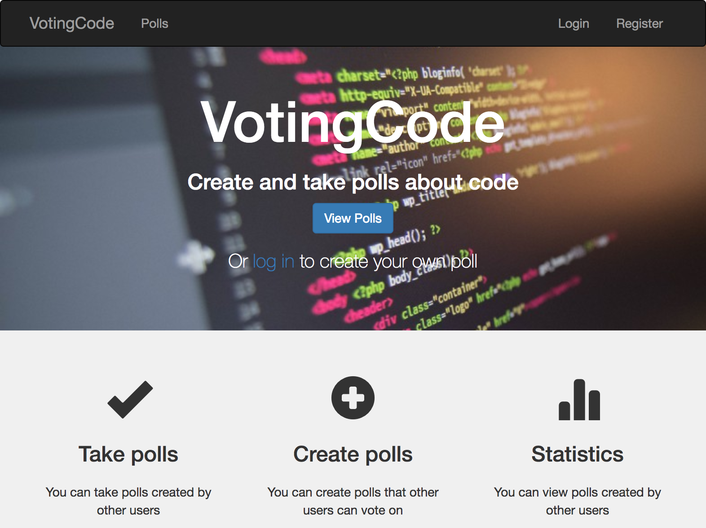

# VotingCode

This is a website where users can create polls about software development and share it with their friends.
Users can vote on those polls and authenticated users can add their own options.
The polls are tagged to enable filtering by topic.



VotingCode is built upon:

* [React](https://facebook.github.io/react/)
* [React Router](https://github.com/ReactTraining/react-router)
* [Redux](https://github.com/reactjs/redux)
* [Redux Sagas](https://github.com/redux-saga/redux-saga)
* [Redux Form](https://redux-form.com/7.3.0/)
* [React-Bootstrap](https://react-bootstrap.github.io/)
* [Styled Components](https://www.styled-components.com/)
* [Node.js](https://nodejs.org/)
* [Express](http://expressjs.com/)
* [Passport](http://passportjs.org/)
* [MongoDB](https://www.mongodb.com/)

## Installation Instructions

* Install [Node.js](https://nodejs.org/) and npm.
* Install [MongoDB](https://www.mongodb.com/).
* Retrieve the repository and install dependencies.

```bash
$ git clone https://github.com/puntnomads/VotingCode.git
$ cd VotingCode
$ npm install
$ cd client
$ npm install
```

## Running the app locally

Start the API

```bash
$ npm start
```

Start React in another Terminal window

```bash
$ cd client
$ npm start
```

Then visit `http://localhost:3000/`
